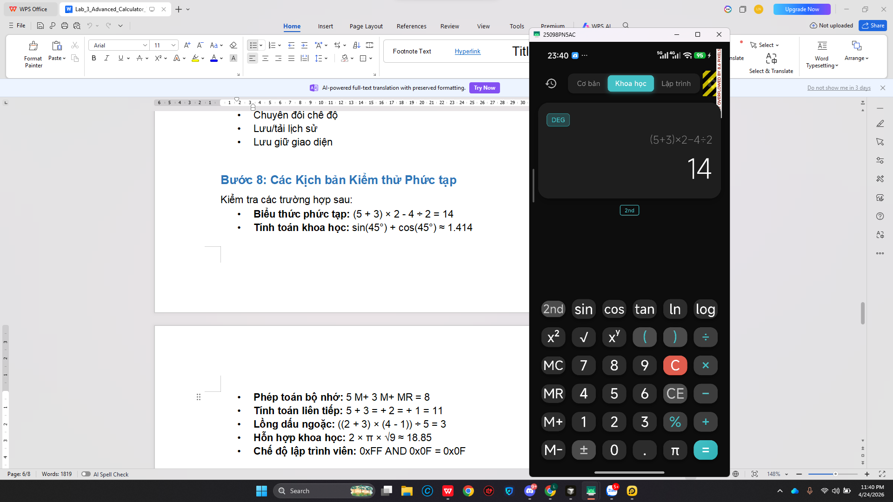
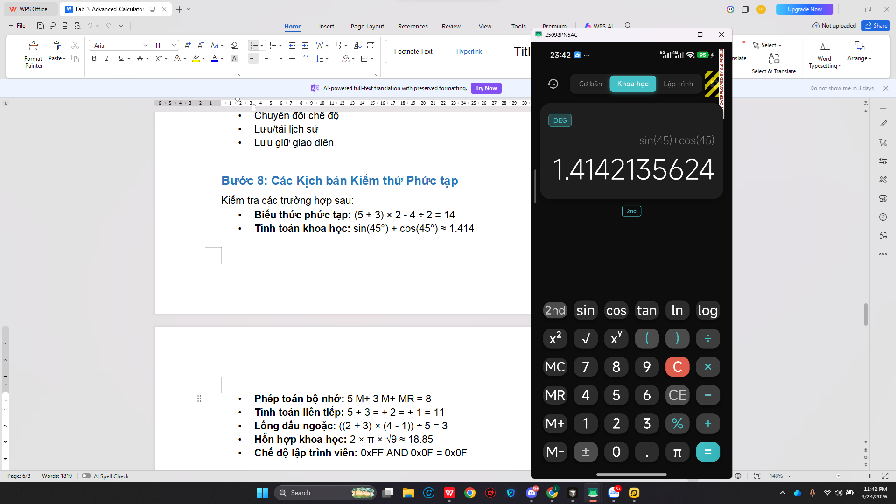
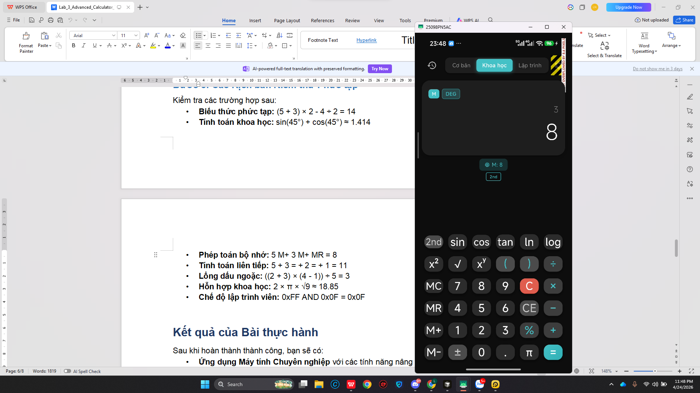
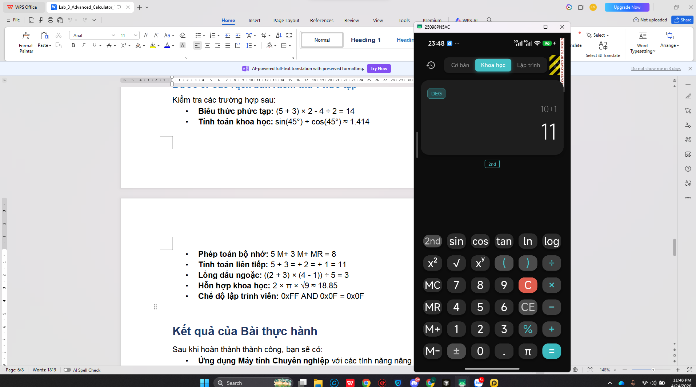
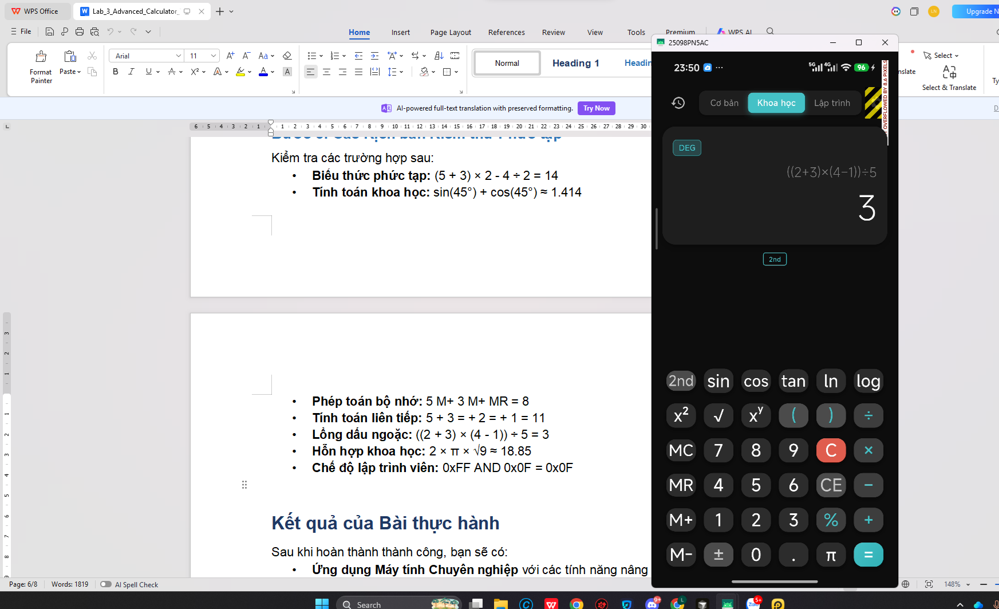
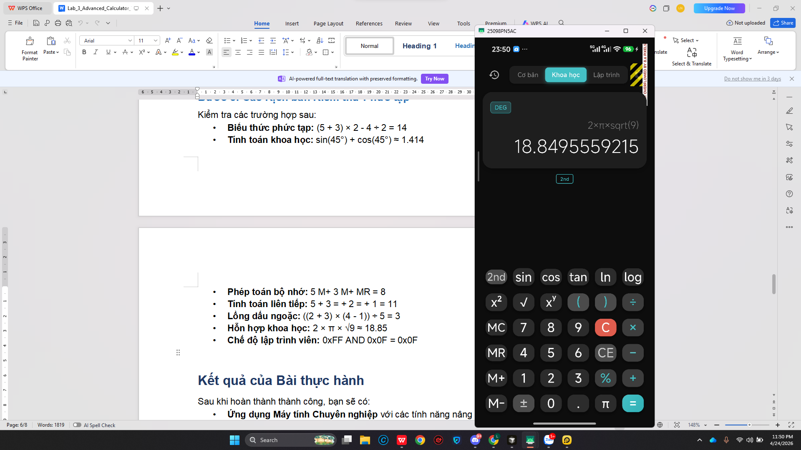
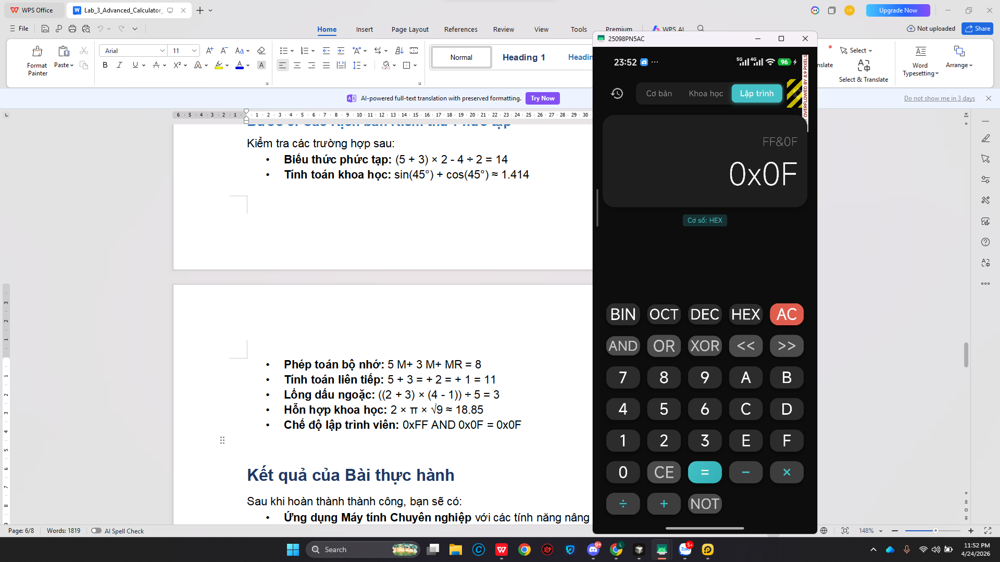

# Máy Tính Nâng Cao - Flutter Advanced Calculator

**Nguyễn Thanh Liêm - 2224802010267**

---

## Demo

https://github.com/user-attachments/assets/placeholder-demo.mp4

---

## Hình Ảnh

| 1 | 2 | 3 |
|---|---|---|
|  |  |  |

| 4 | 5 | 6 | 7 |
|---|---|---|---|
|  |  |  |  |

---

## Tính Năng

- **Chế độ Cơ Bản:** +, -, ×, ÷, %, dấu ngoặc, đổi dấu, xóa ký tự
- **Chế độ Khoa Học:** sin, cos, tan, asin, acos, atan, log, ln, sqrt, cbrt, lũy thừa, giai thừa, π, e
- **Chế độ Lập Trình Viên:** Chuyển đổi cơ số (BIN/OCT/DEC/HEX), bitwise (AND, OR, XOR, NOT, SHL, SHR)
- **Bộ nhớ (M+, M-, MR, MC)**
- **Lịch sử tính toán** (tối đa 100 bản ghi)
- **Chế độ DEG/RAD**
- **Độ chính xác thập phân** (2-10 chữ số)
- **Dark/Light Theme**
- **Haptic Feedback & Âm thanh**
- **Vuốt xóa ký tự**
- **Zoom thu phóng**

## Cấu Trúc Dự Án

```
lib/
├── main.dart
├── models/
│   ├── calculator_mode.dart
│   ├── calculator_settings.dart
│   └── calculation_history.dart
├── providers/
│   ├── calculator_provider.dart
│   ├── history_provider.dart
│   └── theme_provider.dart
├── screens/
│   ├── calculator_screen.dart
│   ├── history_screen.dart
│   └── settings_screen.dart
├── services/
│   └── storage_service.dart
├── utils/
│   ├── calculator_logic.dart
│   ├── constants.dart
│   └── expression_parser.dart
└── widgets/
    ├── button_grid.dart
    ├── calculator_button.dart
    ├── display_area.dart
    └── mode_selector.dart
```

## Hướng Dẫn Cài Đặt

```bash
flutter pub get
flutter run
flutter build apk --debug
```

## Bảng Màu

| | Light Theme | Dark Theme |
|---|---|---|
| Background | #F5F5F5 | #0D0D0D |
| Surface | #FFFFFF | #1E1E1E |
| Accent | #FF6B6B | #4ECDC4 |
| Text | #1E1E1E | #FFFFFF |

---

Dự án học tập - Nguyễn Thanh Liêm - 2224802010267
